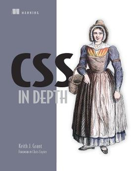

ebook online: https://livebook.manning.com/book/css-in-depth/about-this-book/

## ch01 basic

advice on selector:

1. not use #ID selector;
2. not use !important;

inherit, initial, auto, inline,

Top->Right->Bottom->Left,
box-shadow

## ch02 Related Unit

1in = 25.4mm = 2.54cm = 6pc = 72pt = 96px,
em, rem

> Advice: rem for font-size; px for border; em for others.

@media

viewBox,
--main-bg, var(--main-bg),
document.documentElement,
getComputedStyle(elements),
styles.getPropertyValue('--main-bg'),
elements.style.setProperty('--main-bg', 'blue')

## ch03 box

> IE bug: render main as inline. To fix, using display: block.

aside, box-sizing, content-box, border-box,
float, overflow, display: table, display:table-cell,border-spacing: 1.5em,0;
Flexbox, display: flex, min-height, max-height, min-width, max-width
> Don't set height on an element, before you cannot find a solution.
> Don't set overflow on an element, before you cannot find a solution.
> margin-left, margin-top less then 0, diff with margin-right, margin-bottom less then 0

margin (top/bottom) folder,
.button-link+.button-link, body *+*,

## ch04 float

float, display:inline-block, display:table,
double container pattern, BFC(block formatting context),
> add whitespace before/after "-" in calc().

[class*='column-'], clearfix, ::before, ::after,
container, row, column, gutter, outline
